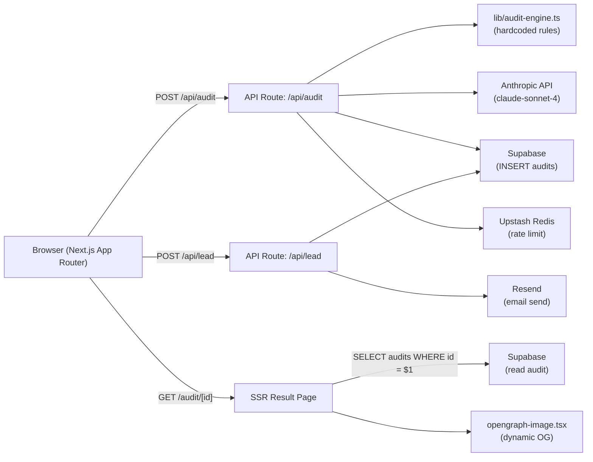

# ARCHITECTURE.md — SpendSight

## System Overview



---

## Data Flow

```
FormData (client)
  → Zod validation
  → Rate limit check (Upstash sliding window, 10/hr/IP)
  → Honeypot check (body.website must be absent)
  → runAuditEngine(formData) → ToolAuditResult[]
  → calculateTotals() → { totalMonthlySavings, totalAnnualSavings }
  → generateAuditSummary() via Anthropic API (or fallback string)
  → Supabase INSERT audits
  → nanoid(10) → audit ID
  → Return AuditResult JSON to client
  → client router.push('/audit/{id}')
  → SSR: fetch audit from Supabase → render page with dynamic OG meta
```

---

## Stack Justification

| Layer | Choice | Why |
|---|---|---|
| Framework | Next.js 14 App Router | SSR for OG tags, API Routes, Vercel-native deployment, no separate backend needed |
| Language | TypeScript (strict) | Required by assignment; prevents runtime errors in audit math |
| Styling | Tailwind CSS + custom CSS vars | Utility-first for layout, CSS variables for design tokens (glassmorphism) |
| Database | Supabase (Postgres) | Relational FK between leads and audits; generous free tier; RLS for security |
| Email | Resend | Best developer experience; plain-text emails; free tier covers MVP volume |
| LLM | Anthropic claude-sonnet-4 | Preferred per spec; excellent at concise, structured prose |
| Rate limiting | Upstash Redis | Serverless-compatible; sliding window; free tier (10k req/day) |
| Deployment | Vercel | Required per spec; native Next.js support; preview deployments |
| Testing | Vitest | Fast, native ESM, Jest-compatible API |

---

## Supabase Schema

```sql
create table audits (
  id text primary key,
  form_data jsonb not null,
  tool_results jsonb not null,
  total_monthly_savings numeric not null,
  total_annual_savings numeric not null,
  ai_summary text,
  created_at timestamptz default now()
);

create table leads (
  id uuid default gen_random_uuid() primary key,
  audit_id text references audits(id),
  email text not null,
  company_name text,
  role text,
  team_size int,
  created_at timestamptz default now()
);

alter table audits enable row level security;
alter table leads enable row level security;
create policy "public_read_audits" on audits for select using (true);
create policy "service_insert_leads" on leads for insert with check (true);
```

---

## Scaling Considerations

- **Audit route** → Move to Edge Runtime for sub-50ms cold starts globally
- **Database** → Enable PgBouncer in Supabase for connection pooling at high concurrency
- **Rate limiting** → Upstash Global Replicas if geo-distributed traffic
- **Result pages** → Add ISR (`revalidate: 3600`) to cache popular audit pages at CDN
- **AI summary** → Cache in Redis by audit ID to avoid duplicate Anthropic calls for shared links
