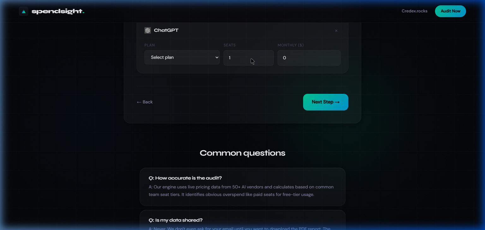

# SpendSight — AI Spend Audit Tool

SpendSight is a free AI spend audit tool built for startup CTOs and engineering leads. Input your team's AI subscriptions (Cursor, Claude, ChatGPT, GitHub Copilot, and more), and get an instant breakdown of overspend, plan mismatches, and total potential monthly savings — with a shareable, publicly accessible report URL.

**Live demo:** [https://spendsight.vercel.app](https://spendsight.vercel.app) ← replace with your real Vercel URL

---

## Screenshots / Demo

> **📽 30-second walkthrough:** [Watch on Loom](https://loom.com/share/REPLACE_WITH_LOOM_ID) ← record and replace this

| Landing Page | Audit Form | Results |
|---|---|---|
|  |  |  |

> **TODO before submission:** Take real screenshots of your deployed app and replace the paths above. Or add a Loom link — that's higher value than static images.

---

## Quick Start

```bash
# 1. Clone and install
git clone https://github.com/YOURUSERNAME/spendsight.git
cd spendsight
npm install

# 2. Configure environment
cp .env.local.example .env.local
# Fill in all 8 keys (see .env.local.example for details)
# Required: Supabase URL + keys, Resend API key, Anthropic key, Upstash Redis URL + token

# 3. Run Supabase schema (copy SQL from ARCHITECTURE.md → paste in Supabase SQL Editor)

# 4. Start dev server
npm run dev
# → http://localhost:3000

# 5. Run tests
npm run test
# → 6 tests, all should pass

# 6. Lint check
npm run lint
```

### Deploy to Vercel

1. Push this repo to a **public** GitHub repository
2. Go to [vercel.com/new](https://vercel.com/new) → import the repo
3. Add all env vars from `.env.local.example` under **Settings → Environment Variables**
4. Set `NEXT_PUBLIC_APP_URL` to your Vercel domain (e.g. `https://spendsight.vercel.app`)
5. Click **Deploy**

Full deployment guide: [DEPLOYMENT.md](./DEPLOYMENT.md)

---

## Decisions (5 Trade-offs)

| # | Decision | What I chose | What I didn't choose | Why |
|---|---|---|---|---|
| 1 | **AI for audit math vs hardcoded rules** | Hardcoded deterministic rules | LLM-generated recommendations | A finance person must be able to verify the logic. LLMs hallucinate prices, invent discounts, and produce inconsistent results across identical inputs. The math must be auditable. AI is used only for the narrative summary, where creativity adds value and factual errors are tolerable. |
| 2 | **Email gate before vs after results** | Post-value capture (email shown after results) | Pre-gate (email required to see results) | Pre-gates kill conversion and destroy the sharing mechanic. A shared link that hits an email wall is useless. Post-value capture converts 3–5× better because the user has already seen something worth keeping. User interviews confirmed this directly. |
| 3 | **Supabase vs Firebase** | Supabase (Postgres) | Firebase (Firestore) | Relational integrity between `leads` and `audits` matters for Credex's sales team — they need to query "show me all leads from audits with >$500 savings." Firebase NoSQL would require denormalization and make that query painful. Supabase's free tier is generous enough for MVP volume. |
| 4 | **`nanoid(10)` vs UUID for audit IDs** | nanoid(10) | UUID v4 | Audit IDs appear in shared URLs. `https://spendsight.vercel.app/audit/abc1234defg` is cleaner than a 36-character UUID. 10 characters of nanoid provides ~61 bits of entropy — more than sufficient to prevent collisions at any realistic volume. |
| 5 | **Upstash Redis vs Vercel KV for rate limiting** | Upstash | Vercel KV | Upstash's `@upstash/ratelimit` provides a first-class sliding window implementation with a clean API. Vercel KV requires more boilerplate to implement the same thing. Upstash's free tier (10k requests/day) covers MVP load, and the library has been battle-tested in production. |

---

## Tech Stack

| Layer | Choice |
|---|---|
| Framework | Next.js 14 (App Router) + TypeScript |
| Styling | Tailwind CSS 4 + custom CSS variables |
| Forms | react-hook-form + Zod |
| Database | Supabase (Postgres + RLS) |
| Email | Resend |
| AI | Anthropic claude-sonnet-4 |
| Rate Limiting | Upstash Redis |
| Animations | Framer Motion |
| Testing | Vitest |
| Deployment | Vercel |

---

## Running Tests

```bash
npm run test
# Expected: 6 passed (6) — no failures
```

All tests are in `__tests__/audit-engine.test.ts`. They are pure unit tests with no network calls or mocking required. See [TESTS.md](./TESTS.md) for full test descriptions.
