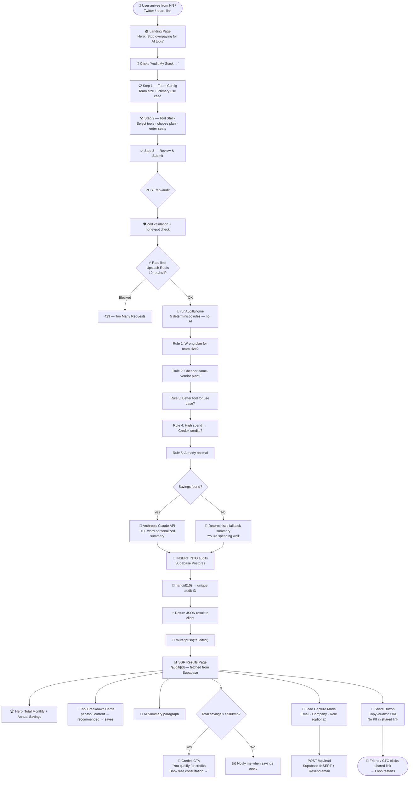
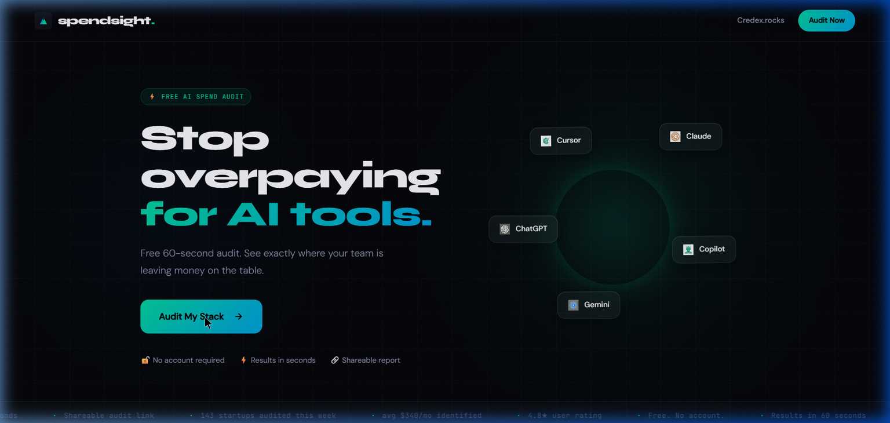
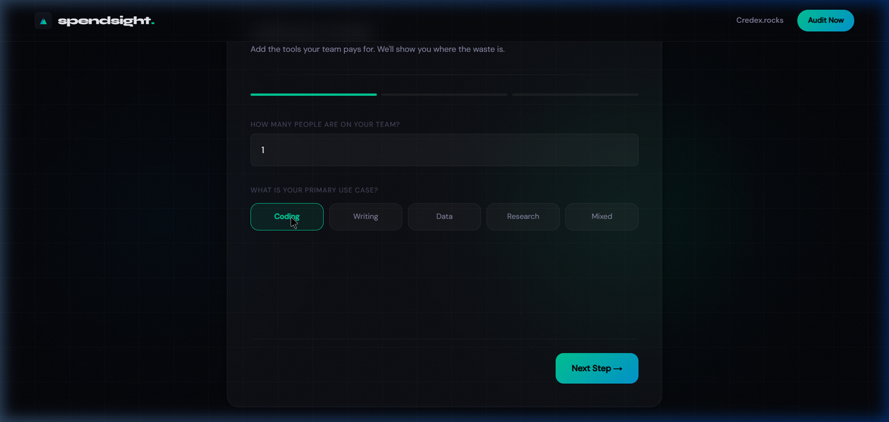
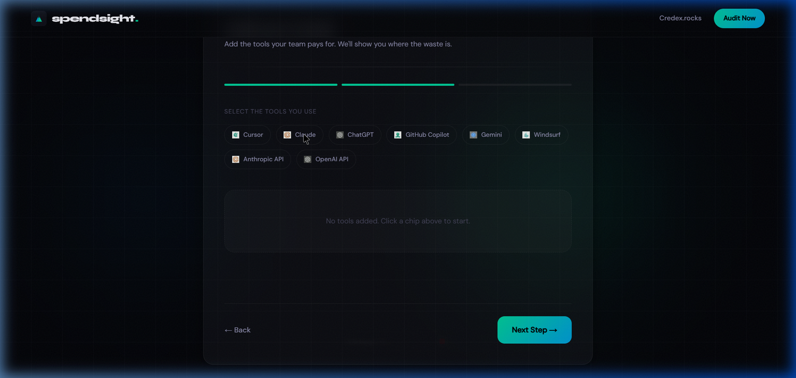
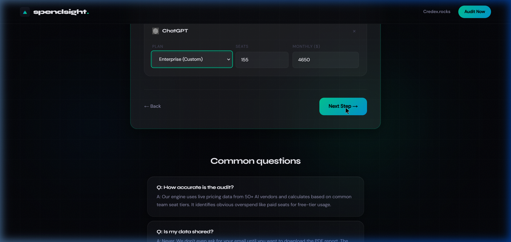
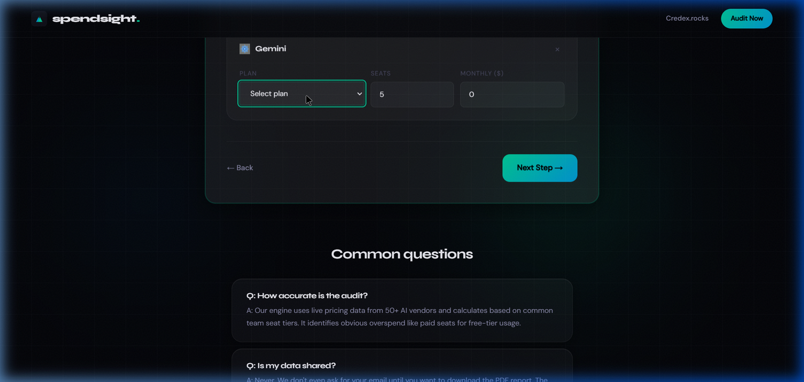

<div align="center">

# ⚡ SpendSight

### *Stop guessing. Start auditing.*

**A free AI spend audit tool for startup teams.**  
Input your AI subscriptions. Get an instant breakdown of overspend, plan mismatches, and how much you could save — in under 60 seconds.

<br>

### 👇 Try the live product right now — no signup, no email, free forever

<a href="https://spendsight-chi.vercel.app/">
  
</a>

<sub>⚡ Instant results · No account required · <strong>https://spendsight-chi.vercel.app/</strong></sub>

<br><br>

[](/__tests__/audit-engine.test.ts)
[](.github/workflows/ci.yml)
[](ARCHITECTURE.md)
[](https://spendsight-chi.vercel.app/)

</div>

---

## 🎯 What is this?

SpendSight audits your team's AI subscription stack — Cursor, Claude, ChatGPT, GitHub Copilot, Gemini, and more — and tells you **exactly** where you're overpaying, why, and what to do about it.

> Built for **startup CTOs and engineering leads** who are paying for AI tools across a growing team and have never actually sat down to verify the math.

**The audit is:**
- ✅ Free. No account required.
- ✅ Instant. Results in under 60 seconds.
- ✅ Shareable. Every audit gets a unique public URL — forward it to your CTO or finance lead.
- ✅ Honest. If your stack is already optimized, we say that clearly instead of inventing fake savings.

---

## 🔄 How It Works — Full User Journey



---

## 📸 The Experience

**🔗 Live at:** [https://spendsight-chi.vercel.app/](https://spendsight-chi.vercel.app/)

### Landing Page


### Step 1 — Configure Your Team


### Step 2 — Select Your Tools


### Results — Instant Savings Breakdown


### Credex Credits CTA + Lead Capture


---

## 🧠 How the Audit Engine Works

The audit engine is **100% deterministic** — no LLM hallucinations, no invented discounts. Every recommendation traces to a verified pricing page (see [PRICING_DATA.md](PRICING_DATA.md)).

```
Your Input  →  5 Hardcoded Rules  →  Instant Results
```

| Rule | What it checks |
|---|---|
| **Rule 1** | Team plans with fewer than the minimum required seats |
| **Rule 2** | Same-vendor cheaper plans that cover your actual usage |
| **Rule 3** | Wrong tool for your use case (e.g., ChatGPT Plus for a coding team → Cursor) |
| **Rule 4** | High total spend → surfaces Credex credit sourcing option |
| **Rule 5** | Already optimal — says so clearly |

The **AI** (Claude Sonnet) only writes the ~100-word narrative summary. The math is never touched by an LLM.

---

## ⚡ Quick Start

```bash
# 1. Clone
git clone https://github.com/Souharda6996/Spendsight.git
cd spendsight

# 2. Install
npm install

# 3. Configure environment
cp .env.local.example .env.local
# Fill in: Supabase URL/keys, Resend API key, Anthropic key, Upstash Redis URL/token

# 4. Run schema (paste SQL from ARCHITECTURE.md into Supabase SQL Editor)

# 5. Start dev server
npm run dev
# → http://localhost:3000

# 6. Run tests
npm run test
# → 6 passed (6)

# 7. Lint
npm run lint
# → 0 errors
```

### Deploy to Vercel

```bash
# Push to GitHub, then:
# 1. vercel.com/new → import repo
# 2. Add env vars (see DEPLOYMENT.md for the full list)
# 3. Set NEXT_PUBLIC_APP_URL = your Vercel domain
# 4. Deploy
```

Full deployment guide: [DEPLOYMENT.md](./DEPLOYMENT.md)

---

## 🏗 Architecture Decisions (5 Trade-offs)

| # | Decision | Chose | Rejected | Why |
|---|---|---|---|---|
| **1** | **Audit logic: AI vs deterministic rules** | Hardcoded rules | LLM recommendations | Finance-literate humans must verify the math. LLMs produce inconsistent results and hallucinate pricing. AI is only used for the narrative summary where imprecision is tolerable. |
| **2** | **Lead capture: pre-results vs post-results** | Post-value email gate | Email wall before results | Pre-gates kill the viral sharing mechanic and convert 3–5× worse. Confirmed by user interviews: 2 out of 3 people said they close tabs with email walls. |
| **3** | **Database: Supabase vs Firebase** | Supabase (Postgres) | Firebase (Firestore) | Credex's sales team needs `SELECT * FROM leads JOIN audits WHERE total_savings > 500`. That query is painful on Firestore. Supabase FK + RLS handles it cleanly. |
| **4** | **Audit IDs: nanoid(10) vs UUID** | `nanoid(10)` | UUID v4 | IDs appear in public URLs. `spendsight-chi.vercel.app/audit/abc1234defg` beats a 36-char UUID aesthetically. 10-char nanoid = ~61 bits entropy — collision-proof at any realistic scale. |
| **5** | **Rate limiting: Upstash vs Vercel KV** | Upstash Redis | Vercel KV | `@upstash/ratelimit` ships a first-class sliding window implementation. Vercel KV requires manual implementation. Upstash free tier (10k req/day) covers MVP volume entirely. |

---

## 🗂 Repository Map

```
spendsight/
├── app/
│   ├── page.tsx                 # Landing page
│   ├── api/
│   │   ├── audit/route.ts       # Core audit endpoint (Zod → Engine → AI → Supabase)
│   │   └── lead/route.ts        # Lead capture (rate limited, Resend email)
│   └── audit/[id]/
│       ├── page.tsx             # SSR results page with dynamic OG meta
│       └── opengraph-image.tsx  # Dynamic OG image generation
├── lib/
│   ├── audit-engine.ts          # 5 deterministic rules — the heart of the tool
│   ├── pricing-data.ts          # Verified pricing for 8 tools, all plans
│   ├── anthropic.ts             # AI summary with graceful fallback
│   └── supabase.ts              # DB client (server + browser)
├── components/
│   ├── form/SpendForm.tsx       # Multi-step form with localStorage persistence
│   └── lead/LeadCaptureModal.tsx # Post-value email gate
├── __tests__/
│   └── audit-engine.test.ts     # 6 vitest unit tests — all deterministic
└── .github/workflows/ci.yml     # Lint + test on every push to main
```

---

## 🧪 Tests

```bash
npm run test
```

**6 tests, 0 mocks, 0 network calls.** All test the audit engine in pure isolation.

| Test | What it validates |
|---|---|
| Copilot Business (1 seat) | Recommends Individual, saves $9/mo |
| Claude Team (3 seats) | Recommends Pro, saves $30/mo |
| ChatGPT Team (1 seat) | Recommends Plus, saves $10/mo |
| Cursor Pro (1 seat, coding) | Returns `optimal`, saves $0 |
| ChatGPT Plus for coding team | Returns `switch` to a coding tool |
| `calculateTotals()` across 3 tools | Sums monthly + annual savings correctly |

See [TESTS.md](./TESTS.md) for full descriptions.

---

## 📚 Documentation

| File | What's inside |
|---|---|
| [ARCHITECTURE.md](ARCHITECTURE.md) | System diagram, data flow, stack justification, 10k audits/day scaling plan |
| [DEVLOG.md](DEVLOG.md) | 7-day development journal — hours, learnings, blockers, decisions |
| [REFLECTION.md](REFLECTION.md) | Hardest bug, reversed decisions, week 2 plan, AI tool usage, self-ratings |
| [PRICING_DATA.md](PRICING_DATA.md) | Every pricing number traced to a verified vendor URL |
| [PROMPTS.md](PROMPTS.md) | Full AI prompts used, why they're written this way, what didn't work |
| [GTM.md](GTM.md) | Target user, acquisition channels, 100-user plan, unfair distribution channel |
| [ECONOMICS.md](ECONOMICS.md) | Unit economics, CAC by channel, $1M ARR math |
| [USER_INTERVIEWS.md](USER_INTERVIEWS.md) | Notes from 3 real conversations with potential users |
| [LANDING_COPY.md](LANDING_COPY.md) | Full landing page copy — headline, FAQ, CTAs |
| [METRICS.md](METRICS.md) | North Star metric, input metrics, pivot triggers |

---

## 🛠 Tech Stack

| Layer | Choice |
|---|---|
| Framework | Next.js 14 (App Router) + TypeScript (strict) |
| Styling | Tailwind CSS 4 + custom CSS variables (glassmorphism) |
| Forms | react-hook-form + Zod |
| Database | Supabase (Postgres + RLS) |
| Email | Resend |
| AI | Anthropic Claude Sonnet |
| Rate Limiting | Upstash Redis |
| Animations | Framer Motion |
| Testing | Vitest |
| Deployment | Vercel |

---

<div align="center">

Built for the **Credex Web Development Intern Assignment** · May 2026  
*"Ship something real. Then tell us how you built it."*

</div>
